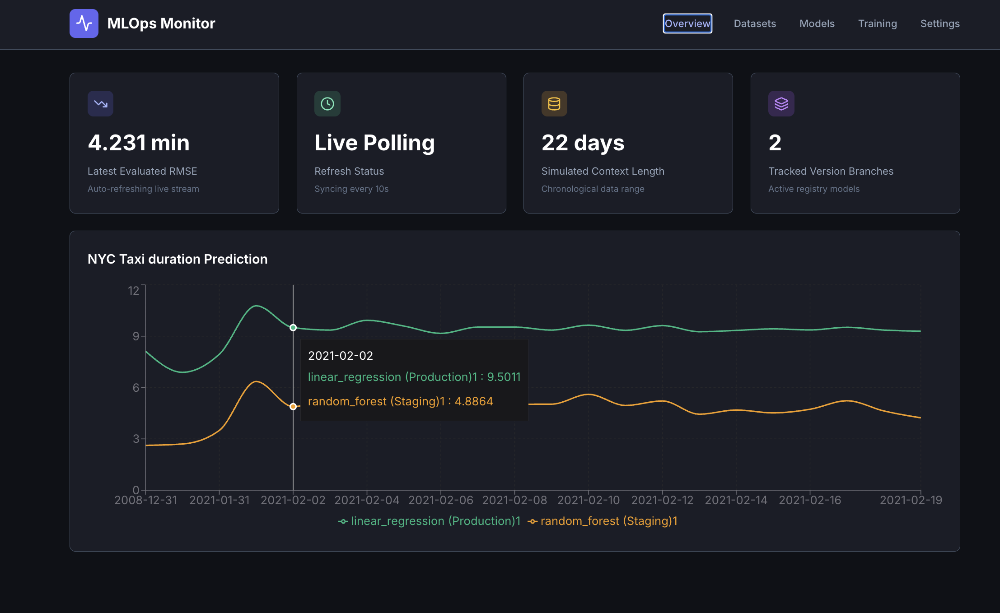
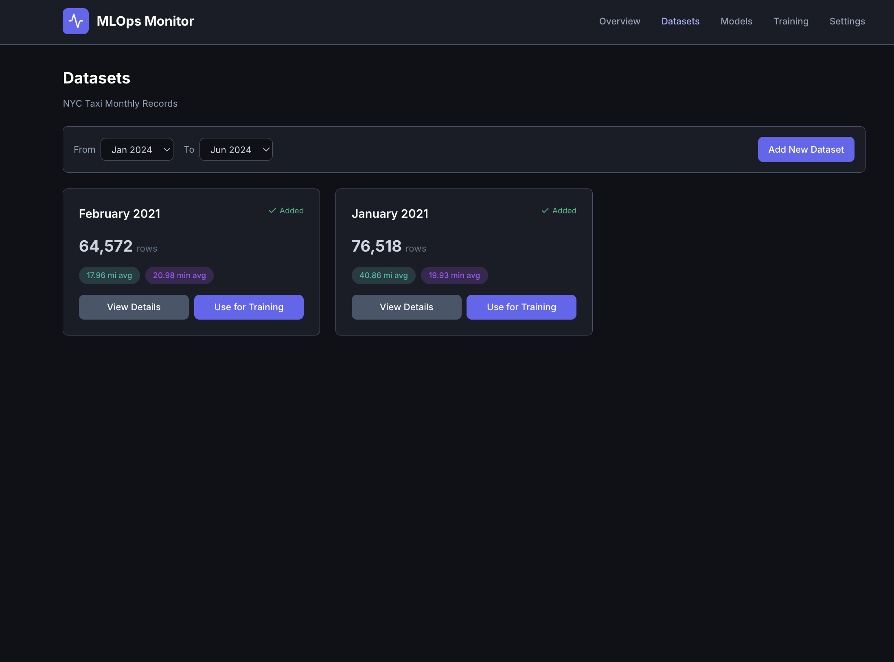
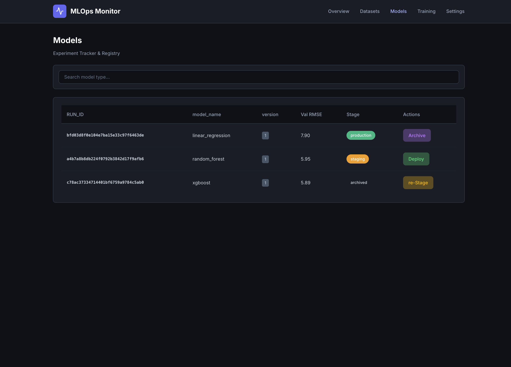
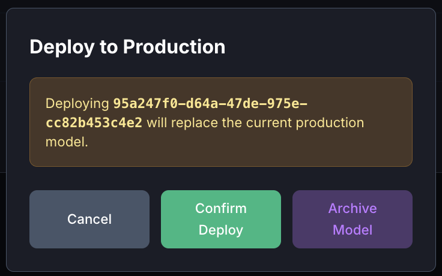
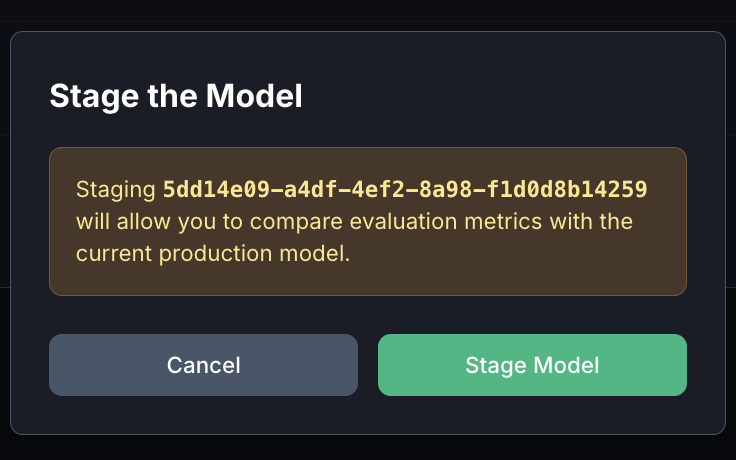
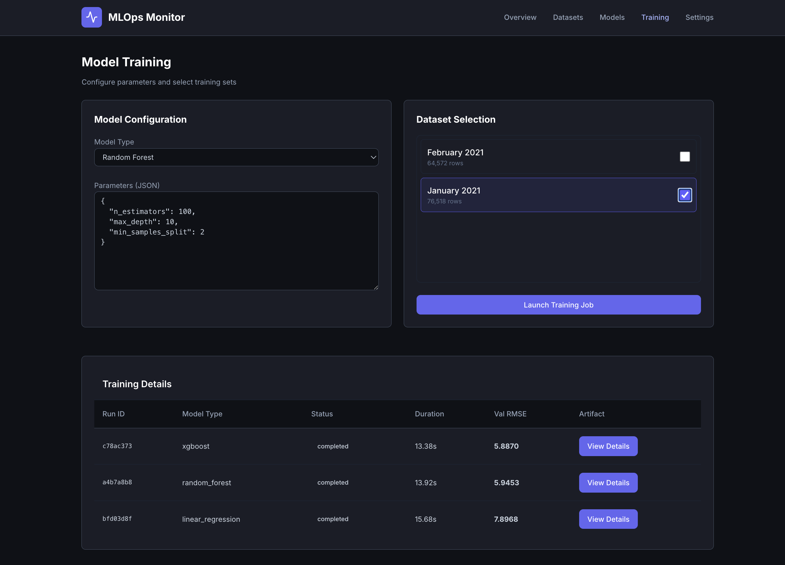
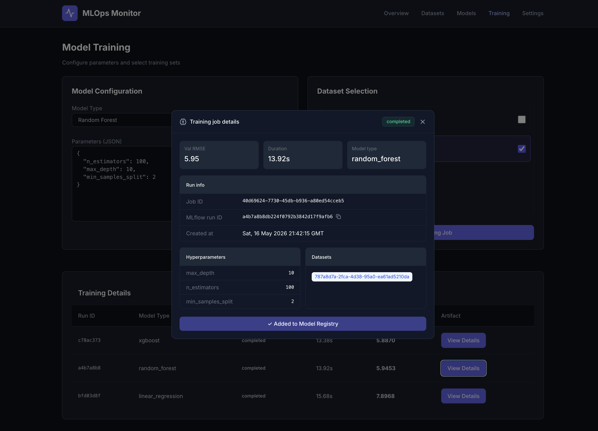

# Building MLOps Monitor: A Full-Stack MLOps Practice Project

## 1. Overview

MLOps Monitor is a end-to-end MLOps practice project built around the NYC Taxi trip duration prediction problem. The goal was to go beyond just training a model and instead build the surrounding infrastructure that makes machine learning reproducible, observable, and deployable in a real-world setting — experiment tracking, model versioning, automated ingestion, performance monitoring, and a UI to tie it all together.

This post walks through the stack, the architecture decisions, and what each piece of the system does.

## 2. The Problem

Predicting NYC taxi trip duration is a classic regression problem. Given pickup/dropoff location IDs and trip distance, can we predict how long a trip will take in minutes? The NYC Taxi dataset is published monthly as Parquet files via a CloudFront URL, making it a natural fit for a periodically ingested MLOps pipeline.

The real challenge is not the model itself — it is everything around it:

- How do you track which model is in production?
- How do you know if model performance degrades over time?
- How do you train a new model, evaluate it, and safely promote it to production without downtime?
---

## What This Project Demonstrates

- **End-to-end ML lifecycle** — from raw Parquet ingestion through feature engineering, training, evaluation, and serving
- **Experiment tracking** — every training run is logged with params, metrics, and artifacts; nothing is lost
- **Model registry with promotion gates** — models move through Candidate → Staging → Production with explicit human approval at each stage
- **Live performance monitoring** — RMSE is computed on real data at every ingestion cycle, not just at training time
- **Hot model swapping** — the production model can be replaced without redeploying or restarting any service
- **Background job execution** — training runs asynchronously via Celery so the prediction API stays responsive

## 3. Stack

### a. Frontend — Next.js on Vercel

The dashboard is built with **Next.js 14 (App Router)** and deployed on **Vercel**. The UI is dark-themed using **Tailwind CSS** for styling, with **Recharts** powering the performance line charts and **TanStack Query** handling data fetching and polling.

Key pages:

- **Overview** — live RMSE line chart showing model performance over time, with separate lines for Production and Staging models. KPI cards show current RMSE, last ingestion time, datasets loaded, and active model count.
- **Datasets** — monthly NYC taxi dataset cards with row counts, average trip distance, and average duration badges. Datasets can be filtered by date range and selected for training.

- **Models** — experiment registry table showing all trained models with their RUN_ID, model type, val RMSE, and current stage (production / staging / archived). Each row has stage-appropriate action buttons — Archive, Deploy, or re-Stage.

    - **Actions**
    
    
- **Training** — model configuration panel where you select a model type (Random Forest, XGBoost, Linear Regression, Lasso), edit hyperparameters as JSON, pick datasets for training, and launch a job. A training details table at the bottom shows all historical runs with their status, duration, val RMSE, and a View Details button.

Supabase Realtime subscriptions push training job status updates directly to the frontend without polling, so the UI reflects job completion the moment it happens.

### b. Backend Services — Python on Railway

All backend services are written in Python and deployed on Railway as separate services. Each has a single responsibility.

- **FastAPI (Prediction API)**

    The prediction API loads a trained model from MLflow by RUN_ID at startup and serves predictions via a `POST /predict` endpoint. It also exposes a `POST /models/stage`, `POST /models/deploy`, `POST /models/archive` endpoinst that hot-swaps the loaded model without restarting the container. This is what gets called when a model is promoted to production — no redeployment needed.

    Input validation uses Pydantic v2 to enforce the prediction schema at the boundary, catching malformed requests before they reach the model pipeline.

- **Celery Training Worker**

    Training is handled by a background worker, completely separate from the Fast API. When a training job is triggered from the UI, a Next.js API route enqueues a Celery task via Redis. The worker picks it up, fetches the relevant Parquet file, runs feature engineering, trains the selected model, evaluates it, logs everything to MLflow, and writes the result back to Supabase.

    Separating training from prediction means a training run never blocks incoming prediction requests, and Railway lets you assign a larger instance size to the worker without paying that cost 24/7.

- **Simulation Cron(Live data)**

    A lightweight scheduled service that periodically fetches the latest NYC taxi Parquet file, calls the Flask `/predict` endpoint with the dataset as input, computes RMSE against actual durations, and writes the result to Supabase. This is what feeds the RMSE-over-time chart on the overview page — each ingestion run adds a data point.

- **MLflow Tracking Server**

    MLflow is self-hosted on Railway as a fourth service. It is configured with:

    - `--backend-store-uri` pointing to Supabase PostgreSQL — so all run metadata, metrics, and params live in a real database rather than local SQLite
    - `--artifact-root` pointing to a Tigris S3 bucket — so model binaries and preprocessors are stored durably in object storage

    MLflow handles all the experiment tracking and model registry lifecycle (Candidate → Staging → Production). The frontend reads from Supabase vis backend, and uses MLflow's SDK (proxied through Next.js API routes) for registry operations.

###  c. Model Registry Lifecycle

The promotion flow is the core MLOps loop:

1. A training job completes and logs a model to MLflow as a Candidate
2. The Models page shows it with a "Promote to Staging" button
3. Staging models can be compared against production in the Overview chart
4. When ready, clicking "Deploy to Production" calls `POST /api/model/deploy`.
5. That route updates the MLflow registry stage and calls `POST /api/model/stage`, `POST /api/model/archive`, `POST /api/model/deploy` on the Flask API with the new RUN_ID
6. FastAPI hot-swaps the model — the production model changes in seconds

### d. Storage — Supabase and Tigris

**Supabase (PostgreSQL)** stores all relational data — datasets, predictions, models, training jobs, and ingestion logs. MLflow also uses it as its backend store, so all experiment metadata lives there too. Supabase Realtime provides live updates to the frontend for free.

**Tigris** is an S3-compatible object storage service used as MLflow's artifact root. All serialized model pipelines, preprocessors, and feature vectorizers are stored there. The Flask API loads models directly from Tigris via MLflow's artifact download at startup and on reload.

### e. Job Queue — Redis and Celery

Redis runs as a Railway service and acts as the Celery message broker and result backend. When a training job is triggered, the task message goes into Redis, the Celery worker picks it up, and the result is written back both to Redis and to Supabase. Supabase is the source of truth for persistent job history — Redis keys can be evicted, but the training_jobs table is permanent.

## 4. Database Schema

Five tables drive the entire application:

- `datasets` — one row per monthly Parquet file, with row count, average trip distance, average duration, and the source URL
- `predictions` — one row per ingestion run, storing RMSE, MAE, the model RUN_ID used, and a sample of predictions for scatter plots
- `models` — mirrors the MLflow registry for fast UI queries, with stage, hyperparams, feature importance, and metric columns
- `training_jobs` — tracks every Celery task from queued through completed or failed, with the resulting MLflow RUN_ID, val RMSE, and duration
- `ingestion_log` — records each ingestion run with row count, duration, and success or failure status

## 5. Feature Engineering

The current feature set is intentionally minimal — pickup and dropoff location IDs are combined into a single interaction feature (`PU_DO`), joined with trip distance, and fed through a `DictVectorizer` before the model. This keeps the pipeline simple while still being meaningful.

The most important architectural decision here is that `build_features()` lives in a single shared module imported by both the training script and the prediction service. Training/serving skew — where training transforms differ from prediction transforms — is one of the most common silent bugs in MLOps. A shared module makes it impossible to diverge.

## 6. Models Trained

Four model types are supported out of the box:

- **Linear Regression** — fast baseline
- **Random Forest** — strong non-linear baseline
- **XGBoost** — gradient boosted trees

All three models can be trained with custom parameters provided by users on selected datasets. More models can be added in the backend further.

## What's Next

- Adding more features to the model — pickup hour, day of week, borough-level aggregations
- Data drift monitoring — plotting feature distributions over time alongside RMSE to detect when the input distribution shifts
- Automated retraining triggers — when live RMSE exceeds a threshold, automatically enqueue a training job on the latest dataset
- Shadow mode evaluation — run the staging model in parallel with production on live traffic before promoting it
